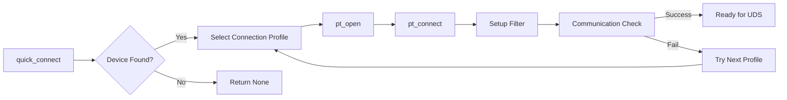

# 🚀 AutoJ2534 - High-Level Vehicle Communication Interface

[](#context-manager-recommended)
[](#uds-service-wrappers)
[](#auto-detection)

A simplified, high-level Python interface for J2534 PassThru vehicle diagnostics. This module wraps the low-level J2534 API to enable ECU communication with just 1-2 lines of code.

---

<details>
<summary>📋 Table of Contents</summary>

- [Features](#-features)
- [Quick Start](#-quick-start)
- [UDS Service Wrappers](#-uds-service-wrappers)
- [Connection Profiles](#-connection-profiles)
- [Custom Profiles](#-custom-profiles)
- [Protocol Scanning](#-protocol-scanning)
- [Error Handling](#-error-handling)
- [API Reference](#-api-reference)
- [Requirements](#-requirements)

</details>

---

## ✨ Features

- ⚡ **One-line connections** - `quick_connect()` function for instant setup
- 🔄 **Context manager support** - Automatic cleanup with `with` statement
- 🔍 **Auto-detection** - Automatically find and connect to responding ECUs
- 🛠️ **UDS service wrappers** - Built-in functions for VIN, DTCs, Security Access
- 📋 **Pre-configured profiles** - Ready-to-use connection configs for Chrysler and OBD-II
- 🔁 **Retry logic** - Configurable retries and timeouts for robust communication
- 📡 **Multi-protocol support** - ISO15765 (CAN), SCI-A, SCI-B protocols

---

## 🚀 Quick Start

### 1-Line Connection

```python
from AutoJ2534 import quick_connect

comm = quick_connect()  # Connect to device 0 with default profile
if comm:
    print(f"VIN: {comm.read_vin()}")
    comm.close()
```

### Context Manager (Recommended)

```python
from AutoJ2534 import J2534Communications

# Auto-connect and auto-cleanup
with J2534Communications(0, "chrys1") as comm:
    vin = comm.read_vin()
    print(f"VIN: {vin}")

    # Read DTCs
    dtcs = comm.read_dtc_codes()
    for dtc in dtcs:
        print(f"DTC: {dtc}")
# Connection automatically closed on exit
```

> [!TIP]
> Using the context manager (`with` statement) ensures proper cleanup even if an exception occurs.

### Auto-Detection

```python
from AutoJ2534 import auto_detect_connect

comm, info = auto_detect_connect()
if comm:
    print(f"Connected to: {info['tool_name']}")
    print(f"Protocol: {info['connection_name']}")
    print(f"VIN: {comm.read_vin()}")
```

<details>
<summary>📖 Traditional Usage</summary>

```python
from AutoJ2534 import J2534Communications

comm = J2534Communications()

# List available devices
comm.numbered_tool_list()

# Open communication
if comm.open_communication(0, "chrys1"):
    # Send raw UDS command
    response = comm.transmit_and_receive_message([0x22, 0xF1, 0x90])
    print(f"Response: {response}")

    comm.disconnect()
    comm.close()
```

</details>

---

## 🏗️ Architecture



---

## 🛠️ UDS Service Wrappers

Built-in methods for common UDS services:

```python
with J2534Communications(0, "chrys1") as comm:
    # Read Vehicle Information
    vin = comm.read_vin()                    # Service 0x22, DID F190
    ecu_id = comm.read_ecu_id()              # Service 0x1A

    # Session Control
    comm.start_diagnostic_session(0x03)      # Extended session
    comm.tester_present()                     # Keep session alive

    # DTC Operations
    dtcs = comm.read_dtc_codes()             # Service 0x19
    comm.clear_dtc_codes()                   # Service 0x14

    # Security Access
    seed = comm.security_access_request_seed(0x01)
    if seed:
        key = calculate_key(seed)  # Your algorithm
        comm.security_access_send_key(0x01, key)

    # ECU Reset
    comm.ecu_reset(0x01)                     # Hard reset
```

> [!WARNING]
> Security Access and ECU Reset can affect vehicle operation. Use with caution and proper authorization.

---

## 📋 Connection Profiles

### Chrysler/FCA Profiles

| Key | Name | Protocol | Use Case |
|-----|------|----------|----------|
| `chrys1` | CHRYSLER ECU CAN 11-BIT | ISO15765 | Standard PCM communication |
| `chrys2` | CHRYSLER ECU CAN 29-BIT | ISO15765 | Extended addressing |
| `chrys6` | CHRYSLER TIPM | ISO15765 | Totally Integrated Power Module |
| `chrys7` | CHRYSLER BCM | ISO15765 | Body control module |
| `chrys10` | CHRYSLER TRANS CAN 11-BIT | ISO15765 | Transmission controller |
| `chrys3` | CHRYSLER ECU SCI A ENGINE | SCI_A | Older engine ECU |
| `chrys4` | CHRYSLER ECU SCI B ENGINE | SCI_B | Older engine ECU |
| `chrys8` | CHRYSLER ECU SCI B TRANS | SCI_B | Older transmission |

### OBD-II Profiles

| Key | Name | Protocol | Use Case |
|-----|------|----------|----------|
| `obd2_can_11bit` | OBD-II Standard CAN 11-bit | ISO15765 | Standard OBD-II |
| `obd2_can_29bit` | OBD-II Extended CAN 29-bit | ISO15765 | Extended OBD-II |
| `obd2_can_250k` | OBD-II CAN 250kbps | ISO15765 | Some vehicles |

---

## 🔧 Custom Profiles

<details>
<summary>Create your own connection profile</summary>

```python
from AutoJ2534 import create_custom_can_config, Connections

# Create a custom configuration
my_config = create_custom_can_config(
    name="My Custom ECU",
    transmit_id=0x7E0,
    receive_id=0x7E8,
    baud_rate=500000,
    use_29bit_addressing=False,
    communication_check=[0x3E, 0x00]  # Tester Present
)

# Add to available connections
Connections.CHRYSLER_ECU['my_custom'] = my_config

# Now use it
comm = J2534Communications()
comm.open_communication(0, "my_custom")
```

</details>

---

## 🔍 Protocol Scanning

Find all responding protocols on a vehicle:

```python
from AutoJ2534 import J2534Communications

comm = J2534Communications()
protocols = comm.scan_all_protocols(device_index=0)

for p in protocols:
    print(f"Found: {p['name']}")
    print(f"  Protocol: {p['protocol']}")
    print(f"  Key: {p['connection_key']}")
```

---

## ⚠️ Error Handling

The module uses UDS negative response codes from `negative_response_codes.py`:

```python
from AutoJ2534 import J2534Communications, get_negative_response_description

with J2534Communications(0, "chrys1") as comm:
    response = comm.transmit_and_receive_message([0x27, 0x01])

    if response is False:
        print("Communication timeout")
    elif isinstance(response, str):
        if response.startswith("67"):
            print("Seed received successfully")
        else:
            # Response contains NRC description
            print(f"Error: {response}")
```

---

## 📚 API Reference

### J2534Communications Class

<details>
<summary>🔌 Connection Methods</summary>

| Method | Description |
|--------|-------------|
| `open_communication(device_index, connection_name)` | Open device and channel |
| `disconnect()` | Close protocol channel |
| `close()` | Close J2534 device |
| `auto_connect()` | Auto-detect and connect |

</details>

<details>
<summary>📡 Communication Methods</summary>

| Method | Description |
|--------|-------------|
| `transmit_and_receive_message(data, loops=0, retries=1, timeout_ms=None)` | Send/receive |
| `transmit_only(data)` | Send without waiting for response |
| `receive_only(data, loops=0)` | Receive response |

</details>

<details>
<summary>🛠️ UDS Wrappers</summary>

| Method | Description |
|--------|-------------|
| `read_vin()` | Read VIN (DID F190) |
| `read_ecu_id(did=0x87)` | Read ECU identification |
| `read_data_by_identifier(did_high, did_low)` | Generic DID read |
| `tester_present(suppress_response=False)` | Keep session alive |
| `start_diagnostic_session(session_type)` | Start UDS session |
| `read_dtc_codes(status_mask=0xFF)` | Read stored DTCs |
| `clear_dtc_codes()` | Clear all DTCs |
| `security_access_request_seed(level)` | Request security seed |
| `security_access_send_key(level, key_bytes)` | Send security key |
| `ecu_reset(reset_type)` | Request ECU reset |

</details>

<details>
<summary>🔧 Utility Methods</summary>

| Method | Description |
|--------|-------------|
| `tool_list()` | Get list of J2534 devices |
| `numbered_tool_list()` | Print numbered device list |
| `tool_info()` | Get device firmware/DLL versions |
| `check_volts()` | Read battery voltage |
| `scan_all_protocols(device_index)` | Find responding protocols |
| `clear_rx()` | Clear receive buffer |
| `clear_tx()` | Clear transmit buffer |

</details>

### Module Functions

| Function | Description |
|----------|-------------|
| `quick_connect(device_index=0, connection_name="chrys1")` | Quick 1-line connection |
| `auto_detect_connect()` | Auto-detect and return (comm, info_dict) |

---

## 📋 Requirements

- Python 3.10+
- Windows OS (uses winreg)
- J2534 device with installed drivers

---

## 📜 Version History

| Version | Changes |
|---------|---------|
| **2.0.0** | Major refactoring with context manager, UDS wrappers, retry logic |
| **1.0.0** | Initial release |

---

## 📄 License

MIT License - See LICENSE file for details.
