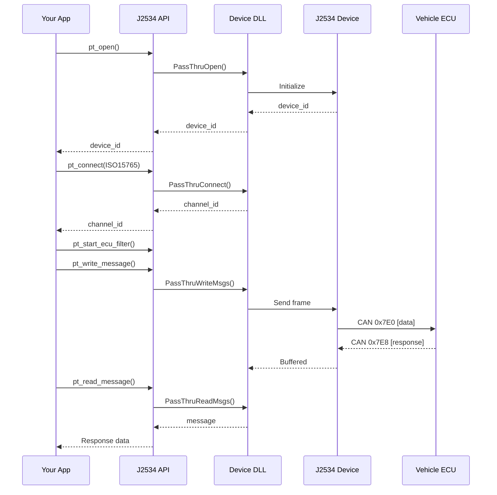

# 🔌 J2534 Low-Level API Module

[](https://www.sae.org/standards/content/j2534-1_202112/)
[](#-api-reference)
[](#-protocol-ids)

A comprehensive Python implementation of the SAE J2534-1 v04.04 PassThru API for vehicle diagnostic communication.

---

<details>
<summary>📋 Table of Contents</summary>

- [Overview](#-overview)
- [Features](#-features)
- [Installation](#-installation)
- [Quick Start](#-quick-start)
- [Configuration](#-configuration)
- [Module Structure](#-module-structure)
- [API Reference](#-api-reference)
- [Protocol IDs](#-protocol-ids)
- [Baud Rates](#-baud-rates)
- [Error Codes](#-error-codes)
- [Message Building](#-message-building)
- [Exception Handling](#-exception-handling)
- [Protocol-Specific Examples](#-protocol-specific-examples)
- [Common Workflow Examples](#-common-workflow-examples)
- [Advanced Usage](#-advanced-usage)
- [Troubleshooting](#-troubleshooting)
- [See Also](#-see-also)

</details>

---

## 📖 Overview

The J2534 module provides direct access to J2534 PassThru devices through a clean Python interface. It handles all the low-level details of communicating with J2534 DLLs while providing Pythonic conveniences like type hints, exceptions, and debug logging.



---

## ✨ Features

- ⚡ **Complete J2534-1 v04.04 Implementation** - All 14 API functions fully implemented
- 🔄 **Configurable Error Handling** - Choose between exceptions or return values
- 🐛 **Debug Logging** - Built-in logging with hex dumps for troubleshooting
- 📝 **Type Hints** - Full type annotations for IDE support
- 📚 **Extensive Documentation** - Google-style docstrings throughout
- 🔙 **Backward Compatible** - Maintains compatibility with existing code

---

## 📦 Installation

The J2534 module is part of the J2534-API package:

```python
# Import the entire module
import J2534

# Or import specific items
from J2534 import (
    pt_open, pt_close, pt_connect, pt_disconnect,
    ProtocolId, BaudRate
)
```

---

## 🚀 Quick Start

```python
from J2534 import (
    get_list_j2534_devices,
    set_j2534_device_to_connect,
    pt_open, pt_close,
    pt_connect, pt_disconnect,
    pt_read_message, pt_write_message,
    pt_start_ecu_filter,
    ProtocolId, BaudRate, TxFlags,
    PassThruMsgBuilder
)

# 1. List available J2534 devices
devices = get_list_j2534_devices()
for index, (name, dll_path) in enumerate(devices):
    print(f"{index}: {name}")

# 2. Select a device (by index)
set_j2534_device_to_connect(0)

# 3. Open the device
device_id = pt_open()
if device_id is False:
    print("Failed to open device")
    exit(1)

# 4. Connect a channel (ISO 15765 / CAN)
channel_id = pt_connect(
    device_id,
    ProtocolId.ISO15765,
    0,  # flags
    BaudRate.CAN_500K
)

# 5. Set up a flow control filter (required for ISO 15765)
filter_id = pt_start_ecu_filter(
    channel_id,
    ProtocolId.ISO15765,
    mask_identifier=0xFFFFFFFF,
    pattern_identifier=0x7E8,      # ECU response ID
    flow_control_identifier=0x7E0   # Tester request ID
)

# 6. Create and send a message
tx_message = PassThruMsgBuilder(ProtocolId.ISO15765, TxFlags.ISO15765_FRAME_PAD)
tx_message.set_identifier_and_data(0x7E0, [0x22, 0xF1, 0x90])  # Read VIN
pt_write_message(channel_id, tx_message, 1, 1000)

# 7. Read the response
rx_message = PassThruMsgBuilder(ProtocolId.ISO15765, 0)
result = pt_read_message(channel_id, rx_message, 1, 1000)
if result == 0:
    print(f"Response: {rx_message.dump_output()}")

# 8. Clean up
pt_disconnect(channel_id)
pt_close(device_id)
```

> [!IMPORTANT]
> For ISO15765 (CAN diagnostics), a **flow control filter is required**. Without it, you'll get `ERR_NO_FLOW_CONTROL`.

---

## 🔧 Configuration

<details>
<summary>🐛 Debug Mode</summary>

Enable detailed logging to see what's happening:

```python
from J2534.config import j2534_config

# Enable debug output
j2534_config.enable_debug()

# Now all operations are logged
device_id = pt_open()  # Logs: "pt_open: Called"
                       # Logs: "pt_open: Returned 1 (success)"

# Disable when done
j2534_config.disable_debug()
```

</details>

<details>
<summary>⚠️ Exception Mode</summary>

Choose between return-value or exception-based error handling:

```python
from J2534.config import j2534_config
from J2534.exceptions import J2534OpenError, J2534ConnectError

# Default: Return False on errors
device_id = pt_open()
if device_id is False:
    print("Failed")

# Enable exceptions for detailed error info
j2534_config.enable_exceptions()

try:
    device_id = pt_open()
    channel_id = pt_connect(device_id, 6, 0, 500000)
except J2534OpenError as e:
    print(f"Open failed: {e}")
    print(f"Error code: 0x{e.error_code:02X}")
except J2534ConnectError as e:
    print(f"Connect failed: {e}")
```

</details>

---

## 📁 Module Structure

```
J2534/
├── __init__.py          # Public exports
├── config.py            # Configuration (debug/exception switches)
├── constants.py         # All J2534 constants and enums
├── structures.py        # ctypes structures
├── exceptions.py        # Exception classes
├── api.py               # High-level API functions
├── dll_interface.py     # Low-level DLL binding
├── registry.py          # Windows Registry enumeration
├── logging_utils.py     # Debug logging utilities
└── README.md            # This file
```

---

## 📚 API Reference

### Device Management

| Function | Description |
|----------|-------------|
| `get_list_j2534_devices()` | List available J2534 devices |
| `set_j2534_device_to_connect(index)` | Select a device by index |
| `pt_open()` | Open connection to device |
| `pt_close(device_id)` | Close connection to device |

### Channel Management

| Function | Description |
|----------|-------------|
| `pt_connect(device_id, protocol_id, flags, baud_rate)` | Establish protocol channel |
| `pt_disconnect(channel_id)` | Close protocol channel |

### Message I/O

| Function | Description |
|----------|-------------|
| `pt_read_message(channel_id, message, count, timeout)` | Read messages |
| `pt_write_message(channel_id, message, count, timeout)` | Write messages |

### Periodic Messages

| Function | Description |
|----------|-------------|
| `pt_start_periodic_message(channel_id, message, interval)` | Start periodic TX |
| `pt_stop_periodic_message(channel_id, message_id)` | Stop periodic TX |

### Filters

| Function | Description |
|----------|-------------|
| `pt_start_ecu_filter(channel_id, protocol_id, ...)` | Easy filter setup |
| `pt_start_message_filter(channel_id, type, mask, pattern, flow)` | Manual filter |
| `pt_stop_message_filter(channel_id, filter_id)` | Remove filter |

### Configuration & Utility

| Function | Description |
|----------|-------------|
| `pt_set_config(channel_id, parameters)` | Set channel config |
| `pt_ioctl(channel_id, ioctl_id, input, output)` | IOCTL operations |
| `read_battery_volts(device_id)` | Read battery voltage |
| `clear_receive_buffer(channel_id)` | Clear RX buffer |
| `clear_transmit_buffer(channel_id)` | Clear TX buffer |
| `pt_read_version(device_id)` | Get version info |
| `pt_get_last_error()` | Get error description |

---

## 📡 Protocol IDs

```python
from J2534 import ProtocolId

ProtocolId.J1850_VPW      # 1 - GM vehicles
ProtocolId.J1850_PWM      # 2 - Ford vehicles
ProtocolId.ISO9141        # 3 - K-line (older vehicles)
ProtocolId.ISO14230       # 4 - KWP2000 (European)
ProtocolId.CAN            # 5 - Raw CAN
ProtocolId.ISO15765       # 6 - CAN diagnostics (OBD-II CAN)
ProtocolId.SCI_A_ENGINE   # 7 - Chrysler SCI
ProtocolId.SCI_A_TRANS    # 8 - Chrysler SCI
ProtocolId.SCI_B_ENGINE   # 9 - Chrysler SCI
ProtocolId.SCI_B_TRANS    # 10 - Chrysler SCI
```

---

## ⚡ Baud Rates

```python
from J2534 import BaudRate

# CAN
BaudRate.CAN_125K   # 125,000 bps
BaudRate.CAN_250K   # 250,000 bps
BaudRate.CAN_500K   # 500,000 bps (most common)

# J1850
BaudRate.J1850_PWM_41600  # Ford
BaudRate.J1850_VPW_10400  # GM

# ISO 9141/14230
BaudRate.ISO_10400  # 10,400 bps

# SCI (Chrysler)
BaudRate.SCI_7813   # 7,812.5 bps
BaudRate.SCI_62500  # 62,500 bps (high speed)
```

---

## ❌ Error Codes

```python
from J2534 import ErrorCode

ErrorCode.STATUS_NOERROR          # 0x00 - Success
ErrorCode.ERR_NOT_SUPPORTED       # 0x01 - Not supported
ErrorCode.ERR_INVALID_CHANNEL_ID  # 0x02 - Bad channel ID
ErrorCode.ERR_INVALID_PROTOCOL_ID # 0x03 - Bad protocol ID
ErrorCode.ERR_NULL_PARAMETER      # 0x04 - NULL pointer
ErrorCode.ERR_DEVICE_NOT_CONNECTED # 0x08 - Device disconnected
ErrorCode.ERR_TIMEOUT             # 0x09 - Timeout
ErrorCode.ERR_BUFFER_EMPTY        # 0x10 - No messages
ErrorCode.ERR_NO_FLOW_CONTROL     # 0x17 - Need flow control filter
# ... see constants.py for complete list
```

---

## 🔨 Message Building

<details>
<summary>Using PassThruMsgBuilder</summary>

```python
from J2534 import PassThruMsgBuilder, ProtocolId, TxFlags

# Create a message
message = PassThruMsgBuilder(
    protocol_id=ProtocolId.ISO15765,
    transmit_flags=TxFlags.ISO15765_FRAME_PAD
)

# Set CAN ID and data
message.set_identifier_and_data(0x7E0, [0x22, 0xF1, 0x90])

# Or set just data (ID already in data for some protocols)
message.build_transmit_data_block([0x00, 0x00, 0x07, 0xE0, 0x22, 0xF1, 0x90])

# Dump for debugging
message.dump()  # Prints all fields and hex dump
print(message.dump_output())  # Just hex string: "000007E022F190"
```

</details>

<details>
<summary>Using Structures Directly</summary>

```python
from J2534 import PassThruMessageStructure, create_message

# Using helper function
message = create_message(
    protocol_id=6,
    transmit_flags=0x40,
    data=[0x00, 0x00, 0x07, 0xE0, 0x22, 0xF1, 0x90]
)

# Using structure directly
message = PassThruMessageStructure()
message.protocol_id = 6
message.transmit_flags = 0x40
message.set_data([0x00, 0x00, 0x07, 0xE0, 0x22, 0xF1, 0x90])
```

</details>

---

## ⚠️ Exception Handling

All exceptions inherit from `J2534Error`:

```python
from J2534.exceptions import (
    J2534Error,              # Base class
    J2534OpenError,          # pt_open failed
    J2534CloseError,         # pt_close failed
    J2534ConnectError,       # pt_connect failed
    J2534DisconnectError,    # pt_disconnect failed
    J2534ReadError,          # pt_read_message failed
    J2534WriteError,         # pt_write_message failed
    J2534FilterError,        # Filter operation failed
    J2534IoctlError,         # IOCTL operation failed
    J2534RegistryError,      # Registry access failed
)

# Catch all J2534 errors
try:
    # ... operations ...
except J2534Error as e:
    print(f"Error: {e}")
    if e.error_code:
        print(f"Code: 0x{e.error_code:02X}")
```

---

## 📡 Protocol-Specific Examples

<details>
<summary>🚗 ISO 15765 (CAN Diagnostics) - Most Common</summary>

The most common protocol for modern OBD-II vehicles (2008+). Requires flow control filters.

```python
from J2534 import (
    pt_open, pt_close, pt_connect, pt_disconnect,
    pt_read_message, pt_write_message, pt_start_ecu_filter,
    set_j2534_device_to_connect, ProtocolId, BaudRate, TxFlags,
    PassThruMsgBuilder
)

# Open device and connect ISO15765 channel
set_j2534_device_to_connect(0)
device_id = pt_open()
channel_id = pt_connect(device_id, ProtocolId.ISO15765, 0, BaudRate.CAN_500K)

# Flow control filter is REQUIRED for ISO15765
# Standard OBD-II: Request 0x7DF (broadcast) or 0x7E0, Response 0x7E8
pt_start_ecu_filter(
    channel_id, ProtocolId.ISO15765,
    mask_identifier=0xFFFFFFFF,
    pattern_identifier=0x7E8,       # ECU response CAN ID
    flow_control_identifier=0x7E0   # Tester request CAN ID
)

# Read VIN (UDS Service 0x22, DID 0xF190)
tx_msg = PassThruMsgBuilder(ProtocolId.ISO15765, TxFlags.ISO15765_FRAME_PAD)
tx_msg.set_identifier_and_data(0x7E0, [0x22, 0xF1, 0x90])
pt_write_message(channel_id, tx_msg, 1, 1000)

# Read response
rx_msg = PassThruMsgBuilder(ProtocolId.ISO15765, 0)
if pt_read_message(channel_id, rx_msg, 1, 2000) == 0:
    print(f"VIN Response: {rx_msg.dump_output()}")

pt_disconnect(channel_id)
pt_close(device_id)
```

</details>

<details>
<summary>📡 Raw CAN (Bus Sniffing/Custom Protocols)</summary>

For direct CAN access without ISO-TP framing. Useful for sniffing, custom protocols, or J1939.

```python
from J2534 import (
    pt_open, pt_close, pt_connect, pt_disconnect,
    pt_read_message, pt_write_message, pt_start_message_filter,
    set_j2534_device_to_connect, ProtocolId, BaudRate, FilterType,
    PassThruMsgBuilder, clear_receive_buffer
)

# Connect raw CAN channel
set_j2534_device_to_connect(0)
device_id = pt_open()
channel_id = pt_connect(device_id, ProtocolId.CAN, 0, BaudRate.CAN_500K)

# Pass filter - receive ALL CAN messages (bus sniffing)
pt_start_message_filter(
    channel_id, FilterType.PASS_FILTER,
    mask=[0x00, 0x00, 0x00, 0x00],    # Match any ID
    pattern=[0x00, 0x00, 0x00, 0x00]
)

# Or block filter - receive specific range (e.g., 0x700-0x7FF)
pt_start_message_filter(
    channel_id, FilterType.PASS_FILTER,
    mask=[0x00, 0x00, 0x07, 0x00],    # Mask: check bits 8-10
    pattern=[0x00, 0x00, 0x07, 0x00]  # Pattern: 0x7xx
)

# Read raw CAN frames
clear_receive_buffer(channel_id)
rx_msg = PassThruMsgBuilder(ProtocolId.CAN, 0)
while True:
    if pt_read_message(channel_id, rx_msg, 1, 100) == 0:
        # Raw CAN: 4-byte ID + up to 8 data bytes
        data = rx_msg.get_data_bytes()
        can_id = int.from_bytes(data[0:4], 'big')
        payload = data[4:]
        print(f"CAN ID: 0x{can_id:03X} Data: {payload.hex().upper()}")

pt_disconnect(channel_id)
pt_close(device_id)
```

</details>

<details>
<summary>🚛 29-bit CAN (Extended Addressing / J1939)</summary>

For heavy-duty vehicles and equipment using extended 29-bit CAN IDs.

```python
from J2534 import (
    pt_open, pt_close, pt_connect, pt_disconnect,
    pt_read_message, pt_write_message, pt_start_message_filter,
    set_j2534_device_to_connect, ProtocolId, BaudRate, ConnectFlags,
    TxFlags, PassThruMsgBuilder
)

# Connect with CAN_29BIT_ID flag for extended addressing
set_j2534_device_to_connect(0)
device_id = pt_open()
channel_id = pt_connect(
    device_id,
    ProtocolId.CAN,
    ConnectFlags.CAN_29BIT_ID,  # Enable 29-bit extended IDs
    BaudRate.CAN_250K           # J1939 typically uses 250K
)

# Pass filter for J1939 - receive all 29-bit frames
pt_start_message_filter(
    channel_id, 0,  # PASS_FILTER
    mask=[0x00, 0x00, 0x00, 0x00],
    pattern=[0x00, 0x00, 0x00, 0x00]
)

# Send J1939 request (e.g., PGN 65262 - Engine Temperature)
tx_msg = PassThruMsgBuilder(ProtocolId.CAN, TxFlags.CAN_29BIT_ID)
# J1939 ID format: Priority(3) + PGN(18) + Source Address(8)
j1939_id = 0x18FEF100  # Priority 6, PGN 65262, SA 0x00
tx_msg.set_identifier_and_data(j1939_id, [0x00] * 8)  # Request frame
pt_write_message(channel_id, tx_msg, 1, 1000)

pt_disconnect(channel_id)
pt_close(device_id)
```

</details>

<details>
<summary>🔷 J1850 VPW (GM Vehicles Pre-2008)</summary>

Variable Pulse Width modulation used by General Motors vehicles.

```python
from J2534 import (
    pt_open, pt_close, pt_connect, pt_disconnect,
    pt_read_message, pt_write_message, pt_start_message_filter,
    set_j2534_device_to_connect, ProtocolId, BaudRate,
    PassThruMsgBuilder
)

# Connect J1850 VPW at 10.4 kbps
set_j2534_device_to_connect(0)
device_id = pt_open()
channel_id = pt_connect(
    device_id,
    ProtocolId.J1850_VPW,
    0,
    BaudRate.J1850_VPW_10400
)

# Pass filter for OBD-II responses (mode byte 0x41-0x4F)
pt_start_message_filter(
    channel_id, 0,  # PASS_FILTER
    mask=[0x00],    # Accept all headers
    pattern=[0x00]
)

# Send OBD-II Mode 01 PID 00 (Supported PIDs)
# J1850 VPW format: [Priority/Type] [Target] [Source] [Data...]
tx_msg = PassThruMsgBuilder(ProtocolId.J1850_VPW, 0)
tx_msg.build_transmit_data_block([
    0x68,  # Priority/Type: Functional addressing
    0x6A,  # Target: Broadcast to all emissions ECUs
    0xF1,  # Source: Scan tool
    0x01, 0x00  # Mode 01, PID 00
])
pt_write_message(channel_id, tx_msg, 1, 1000)

# Read response
rx_msg = PassThruMsgBuilder(ProtocolId.J1850_VPW, 0)
if pt_read_message(channel_id, rx_msg, 1, 2000) == 0:
    print(f"J1850 VPW Response: {rx_msg.dump_output()}")

pt_disconnect(channel_id)
pt_close(device_id)
```

</details>

<details>
<summary>🔵 J1850 PWM (Ford Vehicles Pre-2008)</summary>

Pulse Width Modulation used by Ford Motor Company vehicles.

```python
from J2534 import (
    pt_open, pt_close, pt_connect, pt_disconnect,
    pt_read_message, pt_write_message, pt_start_message_filter,
    set_j2534_device_to_connect, ProtocolId, BaudRate,
    PassThruMsgBuilder
)

# Connect J1850 PWM at 41.6 kbps
set_j2534_device_to_connect(0)
device_id = pt_open()
channel_id = pt_connect(
    device_id,
    ProtocolId.J1850_PWM,
    0,
    BaudRate.J1850_PWM_41600
)

# Pass filter for all messages
pt_start_message_filter(
    channel_id, 0,
    mask=[0x00],
    pattern=[0x00]
)

# Send OBD-II Mode 01 PID 00 (Supported PIDs)
# J1850 PWM format: [Priority] [Target] [Source] [Data...]
tx_msg = PassThruMsgBuilder(ProtocolId.J1850_PWM, 0)
tx_msg.build_transmit_data_block([
    0x61,  # Priority: 6, Type: Functional
    0x6A,  # Target: Emissions ECUs
    0xF1,  # Source: Scan tool
    0x01, 0x00  # Mode 01, PID 00
])
pt_write_message(channel_id, tx_msg, 1, 1000)

# Read response
rx_msg = PassThruMsgBuilder(ProtocolId.J1850_PWM, 0)
if pt_read_message(channel_id, rx_msg, 1, 2000) == 0:
    print(f"J1850 PWM Response: {rx_msg.dump_output()}")

pt_disconnect(channel_id)
pt_close(device_id)
```

</details>

<details>
<summary>🟢 ISO 9141 (K-Line, Older European/Asian)</summary>

K-Line protocol requiring 5-baud initialization. Common in pre-2008 European and Asian vehicles.

```python
from J2534 import (
    pt_open, pt_close, pt_connect, pt_disconnect,
    pt_read_message, pt_write_message, pt_start_message_filter,
    pt_ioctl, set_j2534_device_to_connect, ProtocolId, BaudRate,
    IoctlId, PassThruMsgBuilder
)

# Connect ISO 9141 at 10.4 kbps
set_j2534_device_to_connect(0)
device_id = pt_open()
channel_id = pt_connect(
    device_id,
    ProtocolId.ISO9141,
    0,
    BaudRate.ISO_10400
)

# ISO 9141 requires 5-baud initialization
# The J2534 device handles this automatically during pt_connect
# Some devices may require FIVE_BAUD_INIT IOCTL

# Pass filter for OBD-II responses
pt_start_message_filter(
    channel_id, 0,
    mask=[0x00],
    pattern=[0x00]
)

# Send OBD-II request
# ISO 9141 format: [Header1] [Header2] [Source] [Data...] [Checksum]
tx_msg = PassThruMsgBuilder(ProtocolId.ISO9141, 0)
tx_msg.build_transmit_data_block([
    0x68,  # Header: Priority
    0x6A,  # Header: Target
    0xF1,  # Source: Scan tool
    0x01, 0x00  # Mode 01, PID 00
])
# Note: Checksum is calculated automatically by J2534 device
pt_write_message(channel_id, tx_msg, 1, 1000)

# Read response
rx_msg = PassThruMsgBuilder(ProtocolId.ISO9141, 0)
if pt_read_message(channel_id, rx_msg, 1, 3000) == 0:
    print(f"ISO 9141 Response: {rx_msg.dump_output()}")

pt_disconnect(channel_id)
pt_close(device_id)
```

</details>

<details>
<summary>🟡 ISO 14230 / KWP2000 (European Vehicles)</summary>

Keyword Protocol 2000, common in European vehicles. Supports fast initialization.

```python
from J2534 import (
    pt_open, pt_close, pt_connect, pt_disconnect,
    pt_read_message, pt_write_message, pt_start_message_filter,
    pt_ioctl, set_j2534_device_to_connect, ProtocolId, BaudRate,
    IoctlId, PassThruMsgBuilder
)

# Connect ISO 14230 at 10.4 kbps
set_j2534_device_to_connect(0)
device_id = pt_open()
channel_id = pt_connect(
    device_id,
    ProtocolId.ISO14230,
    0,
    BaudRate.ISO_10400
)

# ISO 14230 supports fast initialization (25ms wake-up pattern)
# This is handled automatically by the J2534 device

# Pass filter
pt_start_message_filter(
    channel_id, 0,
    mask=[0x00],
    pattern=[0x00]
)

# KWP2000 Start Diagnostic Session (Service 0x10)
tx_msg = PassThruMsgBuilder(ProtocolId.ISO14230, 0)
tx_msg.build_transmit_data_block([
    0xC0,       # Format byte: Physical addressing, length in header
    0x33,       # Target: ECU address
    0xF1,       # Source: Tester address
    0x10, 0x85  # StartDiagnosticSession, Extended session
])
pt_write_message(channel_id, tx_msg, 1, 1000)

# Read response
rx_msg = PassThruMsgBuilder(ProtocolId.ISO14230, 0)
if pt_read_message(channel_id, rx_msg, 1, 3000) == 0:
    data = rx_msg.get_data_bytes()
    if data[3] == 0x50:  # Positive response
        print("KWP2000 session started successfully")
    elif data[3] == 0x7F:  # Negative response
        print(f"KWP2000 error: NRC 0x{data[5]:02X}")

pt_disconnect(channel_id)
pt_close(device_id)
```

</details>

<details>
<summary>🔴 SCI Protocol (Chrysler/Stellantis Vehicles)</summary>

Chrysler's proprietary SCI (Serial Communication Interface) protocol.

```python
from J2534 import (
    pt_open, pt_close, pt_connect, pt_disconnect,
    pt_read_message, pt_write_message,
    set_j2534_device_to_connect, ProtocolId, BaudRate,
    PassThruMsgBuilder, clear_receive_buffer
)

# SCI-A (low speed) - 7,812.5 baud
set_j2534_device_to_connect(0)
device_id = pt_open()

# Connect to Engine ECU via SCI-A
channel_id = pt_connect(
    device_id,
    ProtocolId.SCI_A_ENGINE,  # Or SCI_A_TRANS for transmission
    0,
    BaudRate.SCI_7813
)

# SCI uses simple command/response protocol
# Send ATZ (reset) command
tx_msg = PassThruMsgBuilder(ProtocolId.SCI_A_ENGINE, 0)
tx_msg.build_transmit_data_block([0x12])  # Example SCI command
pt_write_message(channel_id, tx_msg, 1, 1000)

# Read response
rx_msg = PassThruMsgBuilder(ProtocolId.SCI_A_ENGINE, 0)
if pt_read_message(channel_id, rx_msg, 1, 2000) == 0:
    print(f"SCI Response: {rx_msg.dump_output()}")

pt_disconnect(channel_id)

# SCI-B (high speed) - 62,500 baud
channel_id = pt_connect(
    device_id,
    ProtocolId.SCI_B_ENGINE,  # Or SCI_B_TRANS
    0,
    BaudRate.SCI_62500
)

# SCI-B is used for high-speed data transfer (flash programming)
# ... operations ...

pt_disconnect(channel_id)
pt_close(device_id)
```

</details>

---

## 🔄 Common Workflow Examples

<details>
<summary>📋 Reading DTCs (Diagnostic Trouble Codes)</summary>

```python
from J2534 import (
    pt_open, pt_close, pt_connect, pt_disconnect,
    pt_read_message, pt_write_message, pt_start_ecu_filter,
    set_j2534_device_to_connect, ProtocolId, BaudRate, TxFlags,
    PassThruMsgBuilder
)

def read_dtcs():
    """Read all stored DTCs from vehicle."""
    set_j2534_device_to_connect(0)
    device_id = pt_open()
    channel_id = pt_connect(device_id, ProtocolId.ISO15765, 0, BaudRate.CAN_500K)

    # Set up filter
    pt_start_ecu_filter(
        channel_id, ProtocolId.ISO15765,
        mask_identifier=0xFFFFFFFF,
        pattern_identifier=0x7E8,
        flow_control_identifier=0x7E0
    )

    # UDS Service 0x19: Read DTC Information
    # Sub-function 0x02: Report DTC by Status Mask
    tx_msg = PassThruMsgBuilder(ProtocolId.ISO15765, TxFlags.ISO15765_FRAME_PAD)
    tx_msg.set_identifier_and_data(0x7E0, [
        0x19,  # ReadDTCInformation
        0x02,  # reportDTCByStatusMask
        0xFF   # All DTCs (status mask)
    ])
    pt_write_message(channel_id, tx_msg, 1, 1000)

    # Read response
    rx_msg = PassThruMsgBuilder(ProtocolId.ISO15765, 0)
    if pt_read_message(channel_id, rx_msg, 1, 2000) == 0:
        data = rx_msg.get_data_bytes()[4:]  # Skip CAN ID bytes
        if data[0] == 0x59:  # Positive response
            # Parse DTCs (3 bytes each: High, Mid, Low + Status)
            dtc_data = data[3:]  # Skip service ID, sub-function, status
            for i in range(0, len(dtc_data), 4):
                if i + 3 <= len(dtc_data):
                    dtc = (dtc_data[i] << 16) | (dtc_data[i+1] << 8) | dtc_data[i+2]
                    status = dtc_data[i+3]
                    print(f"DTC: P{dtc:04X} Status: 0x{status:02X}")
        elif data[0] == 0x7F:  # Negative response
            print(f"Error: NRC 0x{data[2]:02X}")

    pt_disconnect(channel_id)
    pt_close(device_id)

read_dtcs()
```

</details>

<details>
<summary>🧹 Clearing DTCs</summary>

```python
def clear_dtcs():
    """Clear all stored DTCs."""
    set_j2534_device_to_connect(0)
    device_id = pt_open()
    channel_id = pt_connect(device_id, ProtocolId.ISO15765, 0, BaudRate.CAN_500K)

    pt_start_ecu_filter(
        channel_id, ProtocolId.ISO15765,
        mask_identifier=0xFFFFFFFF,
        pattern_identifier=0x7E8,
        flow_control_identifier=0x7E0
    )

    # UDS Service 0x14: ClearDiagnosticInformation
    tx_msg = PassThruMsgBuilder(ProtocolId.ISO15765, TxFlags.ISO15765_FRAME_PAD)
    tx_msg.set_identifier_and_data(0x7E0, [
        0x14,        # ClearDiagnosticInformation
        0xFF, 0xFF, 0xFF  # All DTCs (group of DTC = 0xFFFFFF)
    ])
    pt_write_message(channel_id, tx_msg, 1, 1000)

    # Read response
    rx_msg = PassThruMsgBuilder(ProtocolId.ISO15765, 0)
    if pt_read_message(channel_id, rx_msg, 1, 5000) == 0:  # Longer timeout
        data = rx_msg.get_data_bytes()[4:]
        if data[0] == 0x54:  # Positive response
            print("DTCs cleared successfully")
        elif data[0] == 0x7F:
            print(f"Clear failed: NRC 0x{data[2]:02X}")

    pt_disconnect(channel_id)
    pt_close(device_id)

clear_dtcs()
```

</details>

<details>
<summary>🔁 Retry Logic for Robust Communication</summary>

```python
import time
from J2534 import (
    pt_read_message, pt_write_message, PassThruMsgBuilder,
    ProtocolId, TxFlags, clear_receive_buffer
)

def send_with_retry(channel_id, request_data, max_retries=3, timeout_ms=2000):
    """
    Send a UDS request with automatic retry on timeout/negative response.

    Args:
        channel_id: Open J2534 channel
        request_data: List of bytes to send (excluding CAN ID)
        max_retries: Number of retry attempts
        timeout_ms: Response timeout in milliseconds

    Returns:
        Response data bytes or None on failure
    """
    for attempt in range(max_retries):
        # Clear any stale messages
        clear_receive_buffer(channel_id)

        # Send request
        tx_msg = PassThruMsgBuilder(ProtocolId.ISO15765, TxFlags.ISO15765_FRAME_PAD)
        tx_msg.set_identifier_and_data(0x7E0, request_data)
        pt_write_message(channel_id, tx_msg, 1, 1000)

        # Read response
        rx_msg = PassThruMsgBuilder(ProtocolId.ISO15765, 0)
        result = pt_read_message(channel_id, rx_msg, 1, timeout_ms)

        if result == 0:  # Success
            data = rx_msg.get_data_bytes()[4:]  # Skip CAN ID

            # Check for negative response with "busy" NRC
            if data[0] == 0x7F and data[2] in [0x21, 0x78]:
                # 0x21 = busyRepeatRequest, 0x78 = requestCorrectlyReceivedResponsePending
                print(f"ECU busy (NRC 0x{data[2]:02X}), waiting...")
                time.sleep(0.5)
                continue

            return data

        print(f"Attempt {attempt + 1}/{max_retries} failed, retrying...")
        time.sleep(0.1)

    print("All retries exhausted")
    return None

# Usage
response = send_with_retry(channel_id, [0x22, 0xF1, 0x90])  # Read VIN
if response and response[0] == 0x62:  # Positive response
    vin_bytes = response[3:]  # Skip service ID + DID
    vin = bytes(vin_bytes).decode('ascii', errors='ignore')
    print(f"VIN: {vin}")
```

</details>

---

## 🔬 Advanced Usage

<details>
<summary>📝 Custom Logging</summary>

```python
import logging
from J2534.config import j2534_config

# Add file handler
file_handler = logging.FileHandler('j2534_debug.log')
file_handler.setFormatter(logging.Formatter(
    '%(asctime)s - %(levelname)s - %(message)s'
))
j2534_config.logger.addHandler(file_handler)

# Enable debug
j2534_config.enable_debug()
```

</details>

<details>
<summary>🔧 Direct DLL Access</summary>

```python
import ctypes
from J2534.dll_interface import PassThruLibrary, load_j2534_library

# Load DLL directly
dll = load_j2534_library("C:/Path/To/j2534.dll")
library = PassThruLibrary(dll)

# Call functions directly
device_id = ctypes.c_ulong()
result = library.PassThruOpen(ctypes.c_void_p(None), ctypes.byref(device_id))
```

</details>

---

## 🐛 Troubleshooting

<details>
<summary>❌ No Devices Found</summary>

1. Ensure J2534 device drivers are installed
2. Check device is connected via USB
3. Run as Administrator (registry access may require elevation)

</details>

<details>
<summary>⏱️ Connection Failures</summary>

1. Verify vehicle ignition is ON
2. Check OBD-II connector wiring
3. Confirm correct protocol and baud rate
4. Enable debug mode to see detailed errors

</details>

<details>
<summary>📡 Message Timeouts</summary>

1. Ensure flow control filter is set (ISO 15765)
2. Increase timeout values
3. Check vehicle is responding (battery connected)

</details>

---

## 📎 See Also

- [AutoJ2534 README](../AutoJ2534/README.md) - High-level interface
- [J2534_REGISTRY README](../J2534_REGISTRY/README.md) - Device enumeration
- [Examples](../examples/README.md) - GUI examples

---

## 📄 License

MIT License - See LICENSE file for details.
