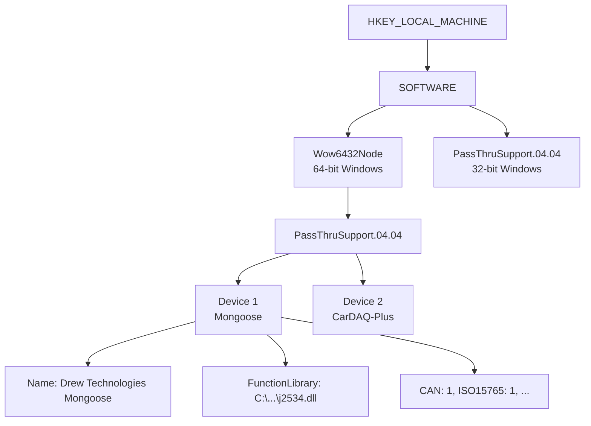

# 🔍 J2534_REGISTRY - Device Registry Scanner

[](#-registry-structure)
[](#-caching-behavior)
[](#-quick-start)

Scan Windows registry for installed J2534 PassThru devices.

---

<details>
<summary>📋 Table of Contents</summary>

- [Overview](#-overview)
- [Quick Start](#-quick-start)
- [Module Structure](#-module-structure)
- [J2534DeviceInfo](#-j2534deviceinfo-dataclass)
- [API Reference](#-api-reference)
- [Registry Structure](#-registry-structure)
- [Caching Behavior](#-caching-behavior)
- [Common Devices](#-common-devices)
- [Integration Example](#-integration-example)

</details>

---

## 📖 Overview

This module provides tools to discover and enumerate J2534 devices installed on Windows systems. It searches the standard registry locations and retrieves device information including:

- Device name and vendor
- DLL path (FunctionLibrary)
- Configuration application path
- Supported protocols (CAN, ISO15765, J1850, SCI, etc.)



---

## 🚀 Quick Start

### Get All Devices

```python
from J2534_REGISTRY import get_all_j2534_devices

devices = get_all_j2534_devices()
for device in devices:
    print(f"{device.name}")
    print(f"  DLL: {device.function_library_path}")
    print(f"  Protocols: {', '.join(device.supported_protocols)}")
```

### Find Device by Name

```python
from J2534_REGISTRY import find_device_by_name

# Partial match (default)
device = find_device_by_name("Mongoose")

# Exact match
device = find_device_by_name("Drew Technologies Mongoose", partial_match=False)

if device:
    print(f"Found: {device.function_library_path}")
```

<details>
<summary>📖 Using the Scanner Class</summary>

```python
from J2534_REGISTRY import J2534RegistryScanner

scanner = J2534RegistryScanner()

# Get all devices
all_devices = scanner.get_all_devices()

# Get devices by protocol
can_devices = scanner.get_devices_by_protocol("CAN")
iso_devices = scanner.get_devices_by_protocol("ISO15765")

# Get device by index
device = scanner.get_device_by_index(0)

# Get only devices with valid DLL files
valid_devices = scanner.get_valid_devices()

# Refresh cache
scanner.refresh_cache()
```

</details>

---

## 📁 Module Structure

```
J2534_REGISTRY/
├── __init__.py          # Package exports
├── device_info.py       # J2534DeviceInfo dataclass
├── registry_scanner.py  # J2534RegistryScanner class
└── README.md            # This file
```

---

## 📋 J2534DeviceInfo Dataclass

```python
@dataclass
class J2534DeviceInfo:
    name: str                           # Display name
    vendor: str                         # Manufacturer
    function_library_path: str          # DLL path
    config_application_path: str        # Config app path (optional)
    supported_protocols: List[str]      # Protocol names

    # Protocol flags
    can_iso15765: bool
    j1850vpw: bool
    j1850pwm: bool
    iso9141: bool
    iso14230: bool
    sci_a_engine: bool
    sci_a_trans: bool
    sci_b_engine: bool
    sci_b_trans: bool

    # Registry info
    device_id: int
    registry_key_path: str
```

---

## 📚 API Reference

### Convenience Functions

| Function | Description |
|----------|-------------|
| `get_all_j2534_devices()` | Get list of all registered devices |
| `find_device_by_name(name)` | Find device by name (partial match) |
| `get_device_count()` | Get number of registered devices |
| `get_scanner()` | Get singleton scanner instance |

### J2534RegistryScanner Methods

| Method | Description |
|--------|-------------|
| `get_all_devices(use_cache=True)` | Get all devices (cached) |
| `get_device_by_name(name, partial=True)` | Find by name |
| `get_devices_by_protocol(protocol)` | Filter by protocol |
| `get_device_by_index(index)` | Get by index |
| `get_device_count()` | Count devices |
| `get_device_names()` | List of names |
| `get_device_dll_paths()` | Dict of name->path |
| `verify_dll_exists(device)` | Check DLL exists |
| `get_valid_devices()` | Only devices with valid DLLs |
| `refresh_cache()` | Force cache refresh |

---

## 🗄️ Registry Structure

The scanner searches these registry paths:

| System | Registry Path |
|--------|--------------|
| 64-bit Windows | `HKLM\Software\Wow6432Node\PassThruSupport.04.04\` |
| 32-bit Windows | `HKLM\Software\PassThruSupport.04.04\` |

### Device Information Values

| Value Name | Type | Required | Description |
|------------|------|----------|-------------|
| `Name` | REG_SZ | Yes | Device display name (e.g., "Drew Technologies Mongoose") |
| `Vendor` | REG_SZ | No | Manufacturer name (e.g., "Drew Technologies") |
| `FunctionLibrary` | REG_SZ | Yes | Full path to J2534 DLL file |
| `ConfigApplication` | REG_SZ | No | Path to vendor configuration utility |

### Protocol Support Flags (REG_DWORD: 0=No, 1=Yes)

| Value Name | Protocol | Typical Use |
|------------|----------|-------------|
| `CAN` | ISO 11898 CAN | Raw CAN bus access |
| `ISO15765` | ISO 15765-4 | OBD-II CAN diagnostics (most common) |
| `J1850VPW` | SAE J1850 VPW | GM vehicles (pre-2008) |
| `J1850PWM` | SAE J1850 PWM | Ford vehicles (pre-2008) |
| `ISO9141` | ISO 9141-2 | K-line (older European/Asian vehicles) |
| `ISO14230` | ISO 14230-4 | KWP2000 (European vehicles) |
| `SCI_A_ENGINE` | Chrysler SCI-A | Chrysler engine module (7,812.5 baud) |
| `SCI_A_TRANS` | Chrysler SCI-A | Chrysler transmission (7,812.5 baud) |
| `SCI_B_ENGINE` | Chrysler SCI-B | Chrysler high-speed engine (62,500 baud) |
| `SCI_B_TRANS` | Chrysler SCI-B | Chrysler high-speed trans (62,500 baud) |

---

## 🔄 Caching Behavior

The scanner caches device information for performance:

```python
from J2534_REGISTRY import J2534RegistryScanner

scanner = J2534RegistryScanner()

# First call: reads from registry, caches result
devices = scanner.get_all_devices()

# Subsequent calls: returns cached data (fast)
devices = scanner.get_all_devices()

# Force refresh after installing new device
scanner.refresh_cache()

# Or bypass cache for single query
devices = scanner.get_all_devices(use_cache=False)
```

> [!TIP]
> Call `refresh_cache()` after installing or uninstalling J2534 devices.

### When to Refresh the Cache

- After installing new J2534 device drivers
- After uninstalling J2534 devices
- When device DLL paths have changed
- When debugging device discovery issues

---

## 🔌 Common Devices

| Device | Vendor | Typical Protocols |
|--------|--------|-------------------|
| Mongoose | Drew Technologies | CAN, ISO15765, J1850, ISO9141 |
| CarDAQ-Plus | Drew Technologies | CAN, ISO15765, J1850, ISO9141 |
| VCM II | Ford Motor Company | CAN, ISO15765, J1850PWM |
| MDI / MDI 2 | General Motors | CAN, ISO15765, J1850VPW |
| KTS Series | Bosch | CAN, ISO15765, ISO9141, ISO14230 |
| TechStream | Toyota | CAN, ISO15765, ISO9141, ISO14230 |
| wiTech | Chrysler/Stellantis | CAN, ISO15765, SCI protocols |

---

## 🔗 Integration Example

```python
from J2534_REGISTRY import get_all_j2534_devices, J2534DeviceInfo
from J2534 import pt_open, set_j2534_device_to_connect

# Get available devices
devices = get_all_j2534_devices()

if not devices:
    print("No J2534 devices found!")
    exit(1)

# Display selection menu
print("Available J2534 Devices:")
for i, device in enumerate(devices):
    print(f"  {i}: {device.name}")

# Select device (example: first one)
selected_device = devices[0]
print(f"Using: {selected_device.name}")

# Use with J2534 module
set_j2534_device_to_connect(selected_device.device_id)
device_id = pt_open()
```

> [!NOTE]
> The `device_id` from `J2534DeviceInfo` corresponds to the index used by `set_j2534_device_to_connect()`.

---

## 📋 Requirements

- Windows OS (uses winreg module)
- Python 3.8+
- Installed J2534 04.04 devices with registry entries

---

## 📄 License

MIT License - See LICENSE file for details.
