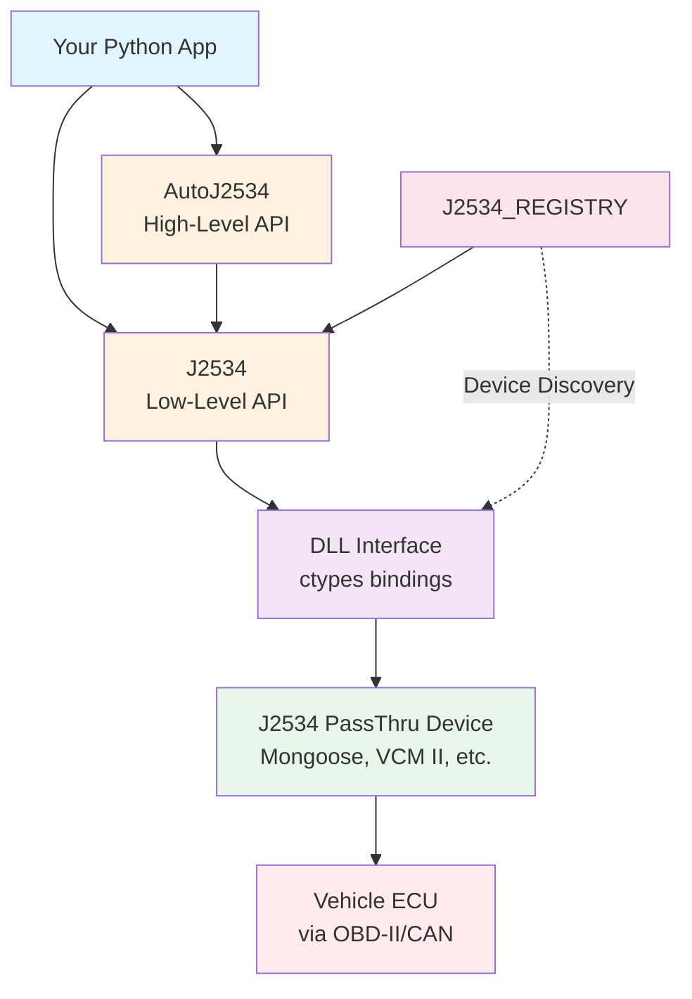

<div align="center">

# 🔓 ECUUNLOCK

[](https://ecuunlock.com)
[](https://youtube.com/@ecuunlock)

---

```
                     ██╗██████╗ ███████╗██████╗ ██╗  ██╗       █████╗ ██████╗ ██╗
                     ██║╚════██╗██╔════╝╚════██╗██║  ██║      ██╔══██╗██╔══██╗██║
                     ██║ █████╔╝███████╗ █████╔╝███████║█████╗███████║██████╔╝██║
                ██   ██║██╔═══╝ ╚════██║ ╚═══██╗╚════██║╚════╝██╔══██║██╔═══╝ ██║
                ╚█████╔╝███████╗███████║██████╔╝     ██║      ██║  ██║██║     ██║
                ╚════╝ ╚══════╝╚══════╝╚═════╝      ╚═╝      ╚═╝  ╚═╝╚═╝     ╚═╝
```

**A Comprehensive Python Library for SAE J2534 PassThru Vehicle Diagnostics**

*Developed by [ECUUNLOCK](https://ecuunlock.com) - Vehicle ECU Programming & Security Research*

[](LICENSE)
[](https://python.org)
[](https://microsoft.com/windows)
[](https://www.sae.org/standards/content/j2534-1_202112/)
[](https://peps.python.org/pep-0561/)
[](#-protocol-support)

[Quick Start](#-quick-start) • [Installation](#-installation) • [Documentation](#-documentation) • [Contributing](#-contributing)

</div>

---

<details>
<summary>📋 Table of Contents</summary>

- [Features](#-features)
- [Installation](#-installation)
- [Requirements](#-requirements)
- [Quick Start](#-quick-start)
- [Protocol Support](#-protocol-support)
- [Architecture](#-architecture)
- [Package Structure](#-package-structure)
- [GUI Examples](#-gui-examples)
- [Configuration](#-configuration)
- [Error Handling](#-error-handling)
- [Documentation](#-documentation)
- [Troubleshooting](#-troubleshooting)
- [Contributing](#-contributing)
- [License](#-license)

</details>

---

## ✨ Features

- ⚡ **Complete SAE J2534-1 Implementation** - Full support for PassThru API v04.04
- 🎯 **High-Level Interface** - Simple, Pythonic API for vehicle diagnostics
- 🔍 **Auto-Discovery** - Automatically find and connect to J2534 devices
- 📡 **Multi-Protocol Support** - CAN, ISO15765, J1850 VPW/PWM, ISO9141, ISO14230, SCI
- 🐛 **Debug Modes** - Built-in debug logging with hex dump utilities
- ⚠️ **Exception Handling** - Optional exception mode for detailed error info
- 🎨 **GUI Examples** - 4 complete GUI frameworks demonstrated
- 📝 **Type Hints** - Full type annotations for IDE support
- 📦 **pip Installable** - Easy installation with optional dependencies

---

## 📦 Installation

### From PyPI (Recommended)

```bash
# Basic installation
pip install j2534-api

# With GUI support (choose your framework)
pip install j2534-api[gui-pyqt5]
pip install j2534-api[gui-customtkinter]
pip install j2534-api[gui-all]  # All GUI frameworks
```

### From Source

```bash
git clone https://github.com/keenanlaws/j2534-api.git
cd j2534-api
pip install -e .
```

---

## 📋 Requirements

| Requirement | Details |
|-------------|---------|
| **Python** | 3.10 or higher (32-bit recommended for J2534 DLL compatibility) |
| **OS** | Windows only (uses Windows Registry and DLLs) |
| **Hardware** | Any SAE J2534-1 compliant PassThru device |

> [!NOTE]
> 32-bit Python is recommended because most J2534 device DLLs are 32-bit. Using 64-bit Python may cause DLL loading failures.

### Supported Devices

| Manufacturer | Devices |
|--------------|---------|
| Drew Technologies | Mongoose Pro, CarDAQ-Plus 3 |
| Ford | VCM II |
| General Motors | MDI, MDI 2 |
| Honda | HDS |
| Toyota | Techstream |
| Bosch | KTS Series |
| *And more...* | Any J2534-1 compliant device |

---

## 🚀 Quick Start

### List Available Devices

```python
from J2534_REGISTRY import get_all_j2534_devices

devices = get_all_j2534_devices()
for device in devices:
    print(f"{device.name} - {device.vendor}")
    print(f"  DLL: {device.function_library_path}")
    print(f"  Protocols: {', '.join(device.supported_protocols)}")
```

### Auto-Connect to Vehicle

```python
from AutoJ2534 import j2534_communication

# Automatically find device and connect to vehicle
result = j2534_communication.auto_connect()

if result:
    tool_index, connection_key, key_name, device_name, firmware_version, dll_version = result
    print(f"Connected to {device_name}")
    print(f"Firmware: {firmware_version}")
    print(f"DLL: {dll_version}")

    # Send a diagnostic message (TesterPresent)
    response = j2534_communication.transmit_and_receive_message([0x3E, 0x00])
    print(f"ECU Response: {response}")

    # Clean up
    j2534_communication.disconnect()
    j2534_communication.close()
```

<details>
<summary>📖 More Examples</summary>

### Manual Connection with Configuration

```python
from AutoJ2534 import j2534_communication, Connections

# List available devices
j2534_communication.numbered_tool_list()

# Connect to device 0 with Chrysler PCM configuration
if j2534_communication.open_communication(device_index=0, connection_name="chrys1"):
    # Get device info
    info = j2534_communication.tool_info()
    print(f"Device: {info[0]}, FW: {info[1]}, DLL: {info[2]}")

    # Check battery voltage
    voltage = j2534_communication.check_volts()
    print(f"Battery: {voltage:.2f}V")

    # Send diagnostic request
    response = j2534_communication.transmit_and_receive_message([0x10, 0x01])
    print(f"Response: {response}")

    # Disconnect
    j2534_communication.disconnect()
    j2534_communication.close()
```

### Low-Level API Access

```python
from J2534 import (
    pt_open, pt_close, pt_connect, pt_disconnect,
    pt_read_message, pt_write_message, pt_start_ecu_filter,
    set_j2534_device_to_connect, get_list_j2534_devices,
    ProtocolId, BaudRate, TxFlags, PassThruMsgBuilder,
    j2534_config
)

# Enable debug logging
j2534_config.enable_debug()

# Enable exception mode (raises exceptions on errors)
j2534_config.enable_exceptions()

# List and select device
devices = get_list_j2534_devices()
print(f"Found {len(devices)} devices")
set_j2534_device_to_connect(0)

# Open device
device_id = pt_open()

# Connect with ISO15765 protocol
channel_id = pt_connect(
    device_id=device_id,
    protocol_id=ProtocolId.ISO15765,
    flags=0,
    baud_rate=BaudRate.CAN_500K
)

# Set up flow control filter (required for ISO15765)
filter_id = pt_start_ecu_filter(
    channel_id=channel_id,
    protocol_id=ProtocolId.ISO15765,
    mask_identifier=0xFFFFFFFF,
    pattern_identifier=0x7E8,       # ECU response ID
    flow_control_identifier=0x7E0   # Tester request ID
)

# Create and send a message
tx_msg = PassThruMsgBuilder(ProtocolId.ISO15765, TxFlags.ISO15765_FRAME_PAD)
tx_msg.set_identifier_and_data(0x7E0, [0x3E, 0x00])  # TesterPresent
pt_write_message(channel_id, tx_msg, 1, 1000)

# Read response
rx_msg = PassThruMsgBuilder(ProtocolId.ISO15765, 0)
if pt_read_message(channel_id, rx_msg, 1, 2000) == 0:
    print(f"Response: {rx_msg.dump_output()}")

# Clean up
pt_disconnect(channel_id)
pt_close(device_id)
```

</details>

---

## 📡 Protocol Support

| Protocol | ID | Baud Rate | Use Case |
|----------|:--:|-----------|----------|
| **ISO 15765** | 6 | 500K | Modern CAN diagnostics (OBD-II 2008+) |
| **CAN** | 5 | 125K-500K | Raw CAN bus access, J1939 |
| **J1850 VPW** | 1 | 10.4K | GM vehicles (pre-2008) |
| **J1850 PWM** | 2 | 41.6K | Ford vehicles (pre-2008) |
| **ISO 9141** | 3 | 10.4K | K-Line (older European/Asian) |
| **ISO 14230** | 4 | 10.4K | KWP2000 (European vehicles) |
| **SCI** | 7-10 | 7.8K-62.5K | Chrysler/Stellantis proprietary |

> [!TIP]
> For ISO15765 (CAN diagnostics), a flow control filter is **required**. Use `pt_start_ecu_filter()` to set it up.

---

## 🏗️ Architecture



---

## 📁 Package Structure

```
j2534-api/
├── J2534/                      # Low-level PassThru API
│   ├── api.py                  # High-level API functions
│   ├── config.py               # Debug/exception configuration
│   ├── constants.py            # Protocol constants (IntEnum)
│   ├── dll_interface.py        # DLL bindings
│   ├── exceptions.py           # Exception hierarchy
│   ├── logging_utils.py        # Debug utilities
│   └── structures.py           # ctypes structures
│
├── AutoJ2534/                  # High-level vehicle interface
│   ├── interface.py            # J2534Communications class
│   ├── ecu_parameters.py       # Connection configurations
│   └── negative_response_codes.py  # UDS error codes
│
├── J2534_REGISTRY/             # Windows registry scanner
│   ├── registry_scanner.py     # Device enumeration
│   └── device_info.py          # Device dataclass
│
└── examples/                   # GUI examples (4 frameworks)
```

---

## 🎨 GUI Examples

The library includes complete GUI examples using 4 different frameworks:

| Framework | Description | Installation |
|-----------|-------------|--------------|
| **Tkinter** | Built-in Python GUI | No installation needed |
| **PyQt5** | Professional cross-platform | `pip install j2534-api[gui-pyqt5]` |
| **CustomTkinter** | Modern themed Tkinter | `pip install j2534-api[gui-customtkinter]` |
| **FreeSimpleGUI** | Rapid prototyping | `pip install j2534-api[gui-pysimplegui]` |

```bash
# Run an example
cd examples/tkinter_example
python main.py
```

---

## 🔧 Configuration

<details>
<summary>🐛 Debug Mode</summary>

```python
from J2534 import j2534_config

# Enable verbose debug output
j2534_config.enable_debug()

# Disable debug output
j2534_config.disable_debug()

# Check current state
if j2534_config.is_debug_enabled:
    print("Debug mode is ON")
```

</details>

<details>
<summary>⚠️ Exception Mode</summary>

```python
from J2534 import j2534_config

# Enable exception mode (raises J2534Error on failures)
j2534_config.enable_exceptions()

# Disable exception mode (returns False/None on failures)
j2534_config.disable_exceptions()
```

</details>

<details>
<summary>🚗 Pre-Defined Connections</summary>

The library includes pre-configured connection settings for common vehicles:

```python
from AutoJ2534 import Connections

# Available Chrysler/FCA configurations
print(Connections.CHRYSLER_ECU.keys())
# ['chrys1', 'chrys2', 'chrys3', 'chrys4', 'chrys5', 'chrys6', 'chrys7', 'chrys8']

# SCI protocol configurations
print(Connections.SCI.keys())
# ['SCI_A_ENGINE', 'SCI_A_TRANS', 'SCI_B_ENGINE', 'SCI_B_TRANS']
```

</details>

---

## ⚠️ Error Handling

<details>
<summary>✅ With Exceptions (Recommended)</summary>

```python
from J2534 import j2534_config, pt_open
from J2534.exceptions import J2534OpenError

j2534_config.enable_exceptions()

try:
    device_id = pt_open()
except J2534OpenError as error:
    print(f"Failed to open device: {error}")
    print(f"Error code: {error.error_code}")
```

</details>

<details>
<summary>❌ Without Exceptions</summary>

```python
from J2534 import pt_open

device_id = pt_open()
if device_id is False:
    print("Failed to open device")
```

</details>

---

## 📚 Documentation

| Module | Description | Link |
|--------|-------------|------|
| **J2534** | Low-level PassThru API | [📖 Documentation](J2534/README.md) |
| **AutoJ2534** | High-level interface | [📖 Documentation](AutoJ2534/README.md) |
| **J2534_REGISTRY** | Device discovery | [📖 Documentation](J2534_REGISTRY/README.md) |
| **SAE J2534-1** | Official standard | [🔗 SAE Website](https://www.sae.org/standards/content/j2534-1_202112/) |

---

## 🐛 Troubleshooting

<details>
<summary>❌ No Devices Found</summary>

1. Verify J2534 device drivers are installed
2. Check USB connection to device
3. Run as Administrator (registry access may require elevation)
4. Confirm device appears in Windows Device Manager

> [!TIP]
> Use `get_all_j2534_devices()` to see what devices are detected in the registry.

</details>

<details>
<summary>⏱️ Connection Timeouts</summary>

1. Ensure vehicle ignition is ON
2. Verify correct protocol and baud rate for your vehicle
3. Increase timeout values in `pt_read_message()`
4. Check OBD-II cable connection

</details>

<details>
<summary>📡 Message Filter Errors</summary>

1. For ISO15765, flow control filter is **REQUIRED**
2. Verify CAN IDs match your vehicle's ECU addresses
3. Check filter mask is correctly configured

> [!IMPORTANT]
> Standard OBD-II uses 0x7E0 (request) and 0x7E8 (response). Your vehicle may use different IDs.

</details>

<details>
<summary>💻 DLL Load Failures</summary>

1. Ensure you're using 32-bit Python (most J2534 DLLs are 32-bit)
2. Check the DLL path in the registry is correct
3. Verify all DLL dependencies are present

</details>

---

## 🤝 Contributing

Contributions are welcome! Please feel free to submit a Pull Request.

1. Fork the repository
2. Create your feature branch (`git checkout -b feature/amazing-feature`)
3. Commit your changes (`git commit -m 'Add amazing feature'`)
4. Push to the branch (`git push origin feature/amazing-feature`)
5. Open a Pull Request

---

## 📄 License

This project is licensed under the MIT License - see the [LICENSE](LICENSE) file for details.

---

## 🙏 Acknowledgments

- SAE International for the J2534 PassThru standard
- The Python community for excellent tooling
- All contributors and users of this library

---

> [!WARNING]
> **Disclaimer:** This software is provided for educational and research purposes. Always ensure you have proper authorization before performing vehicle diagnostics. The authors are not responsible for any damage or issues caused by the use of this software.
